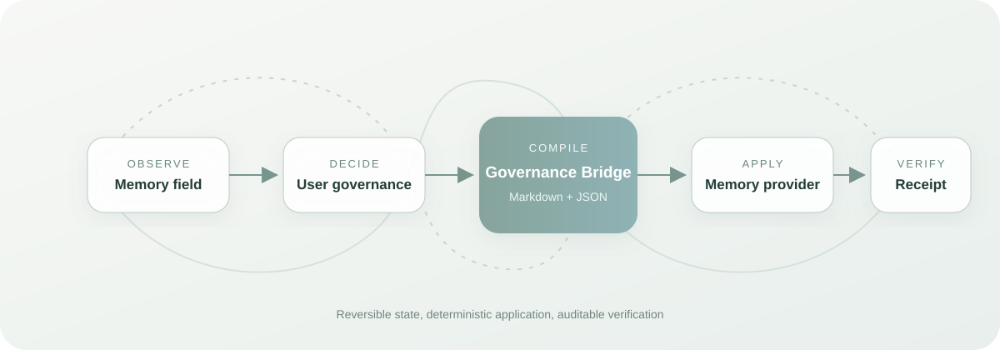
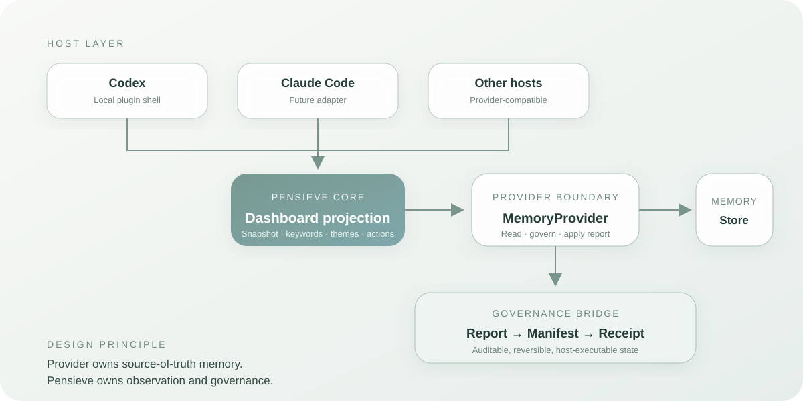

<div align="center">

# Pensieve：看见 AI 如何记住你

### 看见 AI 留下了哪些记忆，理解记忆，治理记忆。

一个本地优先、宿主无关的 Dashboard，让结构化 AI 记忆变得可见、可理解、可治理。

[English](./README.md) · [简体中文](./README.zh-CN.md) · [安装指南](./CODEX_PLUGIN_INSTALL.md) · [架构设计](./PENSIEVE_DASHBOARD_PLUGIN_DESIGN.md)


</div>

## 项目概览

AI 不只是在回答你。随着持续交互，它会逐步形成关于你的工作记忆：偏好、项目、习惯，以及可能敏感的上下文。这些记忆会影响未来回答，但用户通常既看不见它们如何形成，也不知道它们为何被唤起，更无法确认哪些内容应该继续保留。

**Pensieve 让你看见 AI 如何记住你。** 它把隐藏的 Memory State 转化为用户可以理解和操作的控制界面：通过 Provider 读取结构化记忆，展示哪些内容最突出，保护敏感信息，并允许用户执行可逆治理。Governance Bridge 随后把这些决定编译成可审阅的 Markdown 报告、确定性的 JSON Manifest，以及可验证的 Provider Receipt。

Pensieve 不修改模型权重。它治理的是影响未来上下文的外部记忆记录、状态和检索行为。

## 产品全貌

| 层级 | Pensieve 展示的内容 |
| --- | --- |
| **Snapshot** | 记忆总数，以及 active、pinned、softened、hidden、高风险数量 |
| **Priority** | 从可见记忆中确定性派生的关键词权重与主题 |
| **Memory Units** | 包含来源、风险、时间、激活次数与状态的结构化记忆碎片 |
| **Governance** | 可逆的 `pin`、`soften`、`hide`、`restore` 操作 |
| **Write-back** | Markdown 报告、JSON Manifest、目标状态执行与 Receipt 验证 |
| **Protection** | 面向敏感记忆的 Full、Soft-mask、Protected 显示层级 |

## 记忆治理闭环

大多数 Memory 产品停留在存储或召回。Pensieve 关注的是从**观察**到**用户控制权**之间缺失的闭环。



1. Pensieve 读取当前结构化 Memory Field。
2. 用户检查优先级、风险与来源。
3. 用户做出可逆治理决定。
4. Pensieve 将结果编译成 Markdown 与 JSON。
5. Provider 把目标状态应用到实际 Memory Store。
6. Pensieve 通过逐条 Receipt 验证执行结果。

报告基于状态差异生成，而不是回放 UI Event。同一报告重复执行会收敛到相同目标状态，不会重复制造副作用。

## 系统架构

Pensieve 被刻意拆分为一个小型、宿主无关的内核，以及可替换的集成边界。



- **Dashboard Core** 负责 Snapshot、排序、关键词、主题与显示状态。
- **MemoryProvider** 负责真实 Memory State 的读取与变更。
- **Governance Bridge** 把用户决定转换为可移植的报告、Manifest 与 Receipt。
- **Host Adapter** 连接侧边栏生命周期与运行时事件，不把宿主假设泄漏进内核。
- **Local Repository** 提供文件存储的参考实现，用于本地开发与验证。

Provider 接口有意保持精简：

```ts
interface MemoryProvider {
  getSnapshot(): Promise<DashboardSnapshot>
  getMemories(): Promise<DashboardMemoryRecord[]>
  applyAction(action: DashboardAction): Promise<DashboardActionResult>

  getGovernanceStatus?(): Promise<GovernanceBridgeStatus>
  generateGovernanceReport?(): Promise<GovernanceReportArtifact>
  applyGovernanceReport?(reportId: string): Promise<GovernanceReceipt>
}
```

只读 Provider 可以只实现读取能力。真实 Codex、Claude Code 或其他 Memory 系统可以增加 mutation 和 governance 能力，而无需修改 Dashboard。

## 结构化 Memory 模型

Pensieve 将 Memory 定义为语义记录，而不是运行时 Event。

```ts
type MemoryUnit = {
  id: string
  content: string
  keywords: string[]
  priority_score: number
  risk_level: "low" | "medium" | "high"
  status: "active" | "softened" | "hidden"
  pinned: boolean
  created_at: string
  last_activated: string
  activation_count: number
}
```

Event 描述系统如何与记忆交互；Memory Unit 才是被存储、观察和治理的语义对象。

## 快速开始

### 启动本地 Dashboard

```bash
git clone https://github.com/DrJonaC/Pensieve.git
cd Pensieve
npm install
npm run dev
```

打开 `http://localhost:3000/dashboard`。

本地预览使用：

- `data/pensieve-memory-records.json` 作为结构化记忆仓库
- `/api/dashboard-memory` 处理读取和可逆治理动作
- `/api/governance-report` 处理报告生成、Provider 执行与 Receipt

运行时治理产物保存在本地并被 Git 忽略：

```text
data/pensieve-governance/
  reports/
  receipts/
```

### 安装为 Codex 插件

```bash
codex plugin add pensieve-dashboard-plugin@personal
```

本地 Marketplace 与 Windows 配置步骤见 [CODEX_PLUGIN_INSTALL.md](./CODEX_PLUGIN_INSTALL.md)。重新安装后需要创建一个新的 Codex 任务，以加载更新后的插件元数据。

## 安全与治理语义

记忆治理需要比普通“删除按钮”更严格的语义。

- `soften` 降低记忆优先级，但保留原始记录。
- `hide` 抑制活跃召回，并且可以恢复。
- `restore` 将隐藏记忆重新带回 Active Memory Field。
- 高敏感记忆在界面和导出报告中都会使用 Protected Representation。
- JSON Manifest 是机器执行的唯一事实源；Markdown 是人类审阅界面。
- Provider 返回 Receipt 后，Pensieve 才会将报告标记为 Verified。

当前项目不会声称已经实现物理删除。生产级 Hard Delete 还需要 Provider 能力、二次确认、保留策略，以及可审计的删除证明。

## 研究与产品价值

Pensieve 将 LLM Memory 看作三个相互关联的问题：

1. **Retrieval**：哪些记忆会进入未来上下文？
2. **Observability**：用户能否理解系统当前认为哪些信息最重要？
3. **Governance**：用户决定能否可靠地改变未来 Memory Behavior？

因此 Pensieve 不只是 RAG Inspector、静态数据看板或聊天界面。它的产品贡献是可观察、可治理的 Memory Surface；系统贡献是 Provider 与 Host Boundary；研究贡献是从用户意图到 Memory State Verification 的可审计反馈闭环。

## 当前范围

Pensieve 当前以**本地 Codex-Compatible Plugin Source 与参考实现**的形式发布。

已经实现：

- [x] 结构化 Memory Record 与本地持久化
- [x] Query-free Memory Dashboard
- [x] Priority Keywords 与 Surfaced Themes
- [x] 面向敏感信息的治理显示层
- [x] 可逆 Memory Actions
- [x] Governance Report、Manifest 与 Receipt
- [x] 宿主无关的 Provider 和 Adapter Contract
- [x] 有上限的 Host Event Capture，保证本地预览稳定

下一阶段：

- [ ] 原生 Codex Memory Write-back Adapter
- [ ] Claude Code Memory Provider
- [ ] Provider 能力发现与权限交互
- [ ] 基于策略的 Correction、Expiration 与 Hard Delete
- [ ] 治理前后的 Retrieval Evaluation
- [ ] 更多 Memory Store Adapter

## 项目文档

| 文档 | 内容 |
| --- | --- |
| [插件设计](./PENSIEVE_DASHBOARD_PLUGIN_DESIGN.md) | 产品边界、Provider 思路与交互决策 |
| [视觉规范](./PENSIEVE_DASHBOARD_VISUAL_STYLE.md) | 可复用的莫兰迪绿青 Dashboard 语言 |
| [Codex 安装](./CODEX_PLUGIN_INSTALL.md) | 本地 Marketplace 与插件配置 |
| [Governance Bridge 更新](./docs/updates/2026-07-17-governance-bridge.md) | Report、Manifest、Receipt 与 Telemetry 更新 |
| [项目复盘](./PENSIEVE_PROJECT_REVIEW.md) | Motivation、创新性与研究价值 |
| [仓库展示](./docs/PENSIEVE_REPO_SHOWCASE.md) | GitHub、简历与项目展示文案 |

## 参与贡献

Pensieve 仍处于早期阶段，并刻意保持模块化。欢迎围绕 Memory Provider、治理语义、评估、隐私与宿主集成提交 Issue 或聚焦的 Pull Request。

新的集成应当放在 Provider 或 Host Adapter 边界之后，不要直接耦合进 Dashboard Core。

## 开源协议

项目采用 [MIT License](./LICENSE)。

---

<div align="center">

**看见 AI 如何记住你，并决定它下一步应该记住什么。**

</div>
