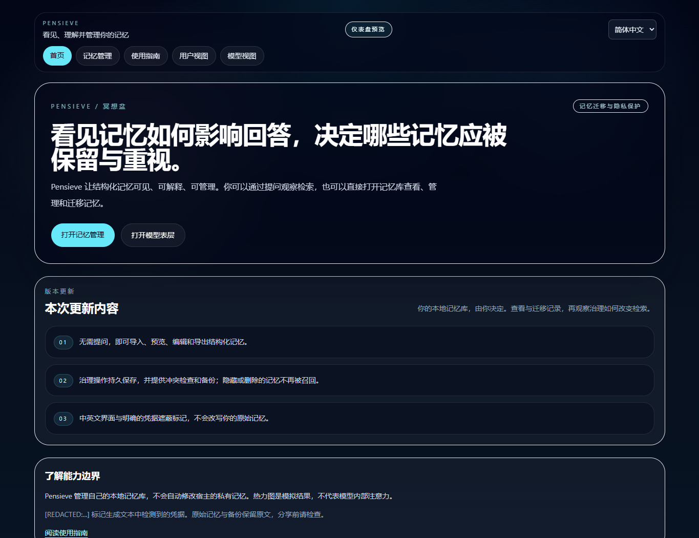

<div align="center">

# Pensieve：看见 AI 如何记住你

**看见记忆，迁移记忆，治理记忆。**

本地优先的结构化 AI 记忆工作台，提供可扩展的插件式仪表盘。

[English](README.md) · [简体中文](README.zh-CN.md) · [迁移指南](docs/MEMORY_MIGRATION.md) · [隐私边界](docs/PRIVACY.md)


</div>

## 为什么做 Pensieve？

记忆会影响助手的回答，但用户需要的不只是一个隐藏的存储层：还需要知道保存了什么、
为何被召回，以及如何修改它。Pensieve 将**可观测、可迁移、可治理**整合为本地界面。

Pensieve 管理的是**外部结构化记忆**，不是模型权重或内部注意力。
当前适配器使用 Pensieve 自己的记忆库，不会自动读取或修改 ChatGPT、Claude、
Codex 或 Claude Code 的私有记忆。

## 本次升级

| 能力 | 用户可以做什么 |
| --- | --- |
| 无需提问的记忆管理 | 导入带版本的 JSON 或纯文本，先预览新增、重复和冲突，再确认 |
| 可迁移备份 | 按范围导出 JSON 或文本；JSON 保留元数据 |
| 编辑与治理 | 编辑内容和关键词，置顶、弱化、隐藏、恢复或确认删除，实际影响检索 |
| 持久化保护 | 版本冲突检查、独占写锁、原子替换和修改前备份 |
| 中英文界面 | 切换界面语言，不自动翻译记忆和生成内容 |
| 凭据遮蔽 | 在模型输入、生成文本、报告和错误中，用 `[REDACTED:...]` 替换可识别凭据 |
| 发布保护 | 数据、备份和密钥不进入发布包；开发诊断路由已移除 |

## 页面导览

| 路由 | 用途 |
| --- | --- |
| `/` | 产品概览、当前会话与主要入口 |
| `/memories` | 导入 → 预览 → 确认 → 管理 → 导出 |
| `/guide` | 概念与操作说明 |
| `/user-view` | 优先关键词、主题和排序后的记忆卡片 |
| `/surface-model` | 模拟/在线提问、回答、解释、请求追踪和模拟热力图 |
| `/dashboard` | 无需提问的仪表盘与模拟宿主预览 |
| `/plugin` | 宿主适配器预览，不代表已连接宿主原生记忆 |



## 快速开始

使用 Node.js 22.18+，CI 使用 Node 22 LTS。

```bash
git clone https://github.com/DrJonaC/Pensieve.git
cd Pensieve
npm ci
npm run dev
```

打开 **http://127.0.0.1:3000/memories**。首次运行会创建包含内置示例的本地记忆库。
记忆管理与模拟模式不需要 API Key。

如需在线模式，在项目根目录创建 `.env.local`：

```dotenv
OPENAI_API_KEY=your_api_key_here
```

服务端使用 OpenAI Responses API。只有主动提交在线查询，才会发送经过凭据过滤的
问题和选中记忆上下文。不要提交 `.env.local`；修改服务端配置后需重启应用。

```bash
npm run build
npm run start
```

开发与生产启动默认只监听本机。这是单用户应用，**没有公共服务所需的身份认证**；
未增加访问控制前，不应直接暴露到公网。

## 技术路线

```text
JSON / 文本 → 校验与预览 → 共享文件记忆库
                              ↓
                   仪表盘 / 记忆管理 / 本地检索
                              ↓
                    模拟回答或服务端模型调用
                              ↓
                    回答 + 解释 + 模拟热力图
```

- 默认数据文件为 `data/pensieve-memory-records.json`；可用 `PENSIEVE_DATA_DIR`
  指定运行数据目录，治理报告也随之保存。
- 检索使用根据当前记录重建的本地词法向量索引，再结合治理状态排序；
  目前不是外部语义 Embedding 服务。
- 隐藏或删除后不再召回，编辑后索引使用新内容。
- Provider 将记忆访问与宿主适配、界面分离；治理报告通过 JSON 记录目标状态，
  并通过回执检查执行结果。
- 热力图是本地模拟，**不是模型真实注意力或因果贡献测量**；模型解释也不是证据本身。

## 隐私与恢复

凭据过滤属于尽力检测，不能保证识别所有秘密或个人信息。目前覆盖常见令牌格式、
带标签的密码/密钥、私钥和部分服务端秘密值。错误在遮蔽凭据后保留原文语言。

**原始记忆、来源记录、导出和备份仍是未加密的本地原始数据。** 分享前必须检查。
删除只移除活跃记录，不会清除全部历史备份，不等于安全擦除；已泄露密钥仍需轮换。

导入默认合并，不静默覆盖冲突。JSON 往返保留来源、时间与治理状态；纯文本每个非空行
作为一条记忆，不调用模型推断个人事实。导出格式不宣称原生兼容 ChatGPT/Claude 备份。

详见[迁移与恢复指南](docs/MEMORY_MIGRATION.md)和[隐私保护说明](docs/PRIVACY.md)。

## 验证

```bash
npm run typecheck
npm test
npm run test:package
npm run build
```

迁移与隐私升级已通过 72 项单元测试、4 项打包策略检查、严格类型检查及生产构建。
浏览器测试在隔离库中使用合成数据验证记忆管理、语言切换和凭据遮蔽，不调用真实模型。
测试入口见 `scripts/check-*-ui.mjs` 与[验证说明](docs/MEMORY_MIGRATION.md#verification)。

## 集成与研究价值

产品重点是让用户能够理解和干预记忆；工程重点是共享持久化、Provider 与宿主边界。
研究方向包括用户如何理解召回、治理如何改变后续检索，以及如何验证用户决策已生效。

原生宿主记忆写回、语义 Embedding Provider、更全面的隐私分类和治理前后效果评估，
仍属于后续工作。参阅[插件配置参考](CODEX_PLUGIN_INSTALL.md)、
[架构设计](PENSIEVE_DASHBOARD_PLUGIN_DESIGN.md)和[项目展示](docs/PENSIEVE_REPO_SHOWCASE.md)。

## 开源协议

[MIT](LICENSE)。欢迎围绕 Provider、治理、隐私与评估提交聚焦的贡献。
