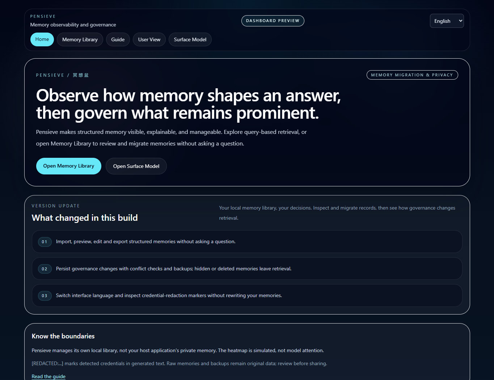

# Pensieve / 项目展示

**A local-first workspace for inspecting, migrating and governing structured AI memory.**

**看见 AI 如何记住你，并决定哪些记忆应被保留。**

## Product Story / 产品逻辑

Memory is useful only if people can understand and control it. Pensieve connects
three steps: inspect what is stored, understand what a query retrieves, and apply
changes that affect future retrieval. It works with structured external records,
not hidden model parameters.

记忆不应只有“存下来”这一步。Pensieve 将查看、理解、迁移和治理连接起来，
既能无需提问地整理记忆，也能通过查询观察被召回的内容。

## Demo Walkthrough / 演示顺序

1. Open Memory Library. Show which local library is being managed and the host-sync boundary.
2. Paste a few synthetic notes. Preview duplicates/conflicts, then confirm import.
3. Edit a memory and export selected records. Explain JSON metadata preservation.
4. Ask a Mock query. Inspect keywords, themes and ranked memories; identify the heatmap as simulated.
5. Hide a memory and query again. Show retrieval exclusion, then restore it.
6. Switch English/Chinese. The interface changes; memory and answer languages do not.
7. Use a synthetic credential in a demo query. Show `[REDACTED:...]` in generated text.

Use only bundled or synthetic memories for public demos. Raw library views and
downloads are not automatically sanitized. Never demonstrate using a real key.

## Engineering Evidence / 工程证据

- Shared file repository across memory management, queries and shipped providers.
- Revision checks, exclusive writes, atomic replacement and pre-change backups.
- Versioned imports, visible conflicts, metadata roundtrips and duplicate prevention.
- Credential filtering around model input/output, errors and governance reports.
- Strict TypeScript, focused tests, package privacy checks and production builds.
- Browser acceptance for migration, bilingual navigation and privacy behavior.

## Research Questions / 研究问题

- Can users accurately understand what the external memory system has retained?
- Do keyword/theme layers make retrieval easier to interpret than a raw record list?
- Does a governance action reliably change subsequent recall?
- How should a product distinguish model explanations from measured attribution?

These are evaluation directions, not claims of completed user studies or measured gains.

## Boundaries / 不能过度宣称

- No direct inspection of model weights or internal attention.
- No automatic synchronization with private ChatGPT/Claude/Codex memories.
- Current retrieval is lexical, not a deployed semantic embedding service.
- Credential filtering is best-effort; raw exports/backups remain sensitive.
- Local deletion is not secure erasure of historical copies.
- This is a local research preview, not an authenticated multi-user cloud service.

[English README](../README.md) · [中文说明](../README.zh-CN.md) ·
[Migration](MEMORY_MIGRATION.md) · [Privacy](PRIVACY.md)
